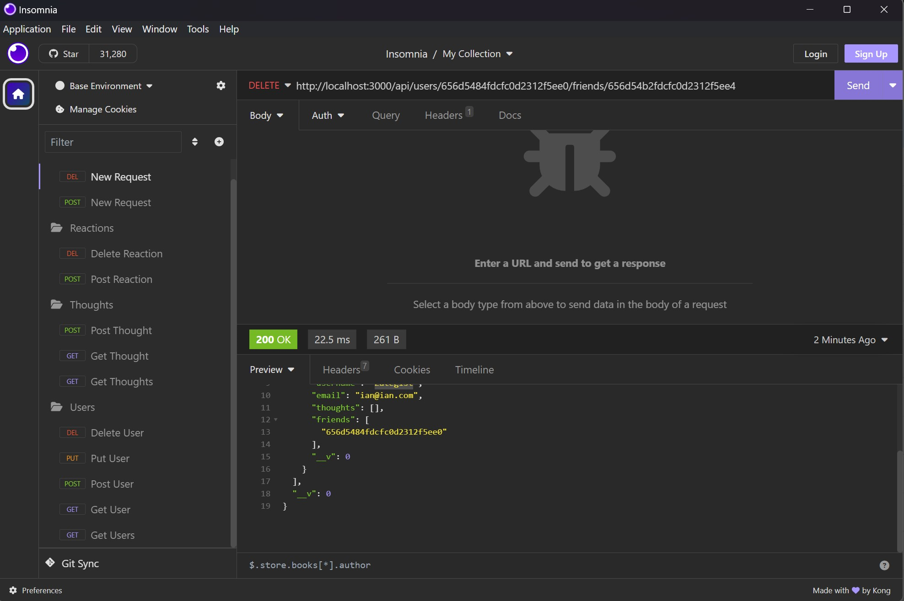

# Social Network Api

## Description

Backend Mongoose routes for a social network

## Table of Contents

- [Installation](#installation)
- [Usage](#usage)
- [License](#license)
- [Contributing](#contributing)
- [Tests](#tests)

## Installation

Instalation/cloning available at the github repository

## Usage

_npm install_ then _node script.js_ in the root directory

Demo: https://drive.google.com/file/d/1nwQGshk6ynbrfHzM0SO27HU4sILhkYz5/view?usp=sharing

## License

This project is licensed under the [MIT License]([License Details](https://opensource.org/licenses/MIT)).

## Contributing

Cardon Hickman

## Tests

N/A

## Questions

https://github.com/C-Hickman23
cardonhickman@gmail.com
